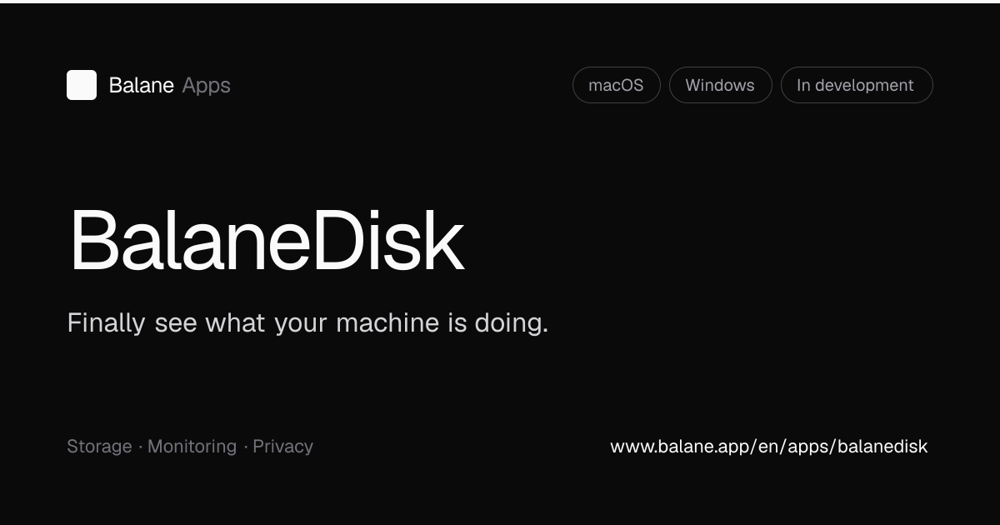
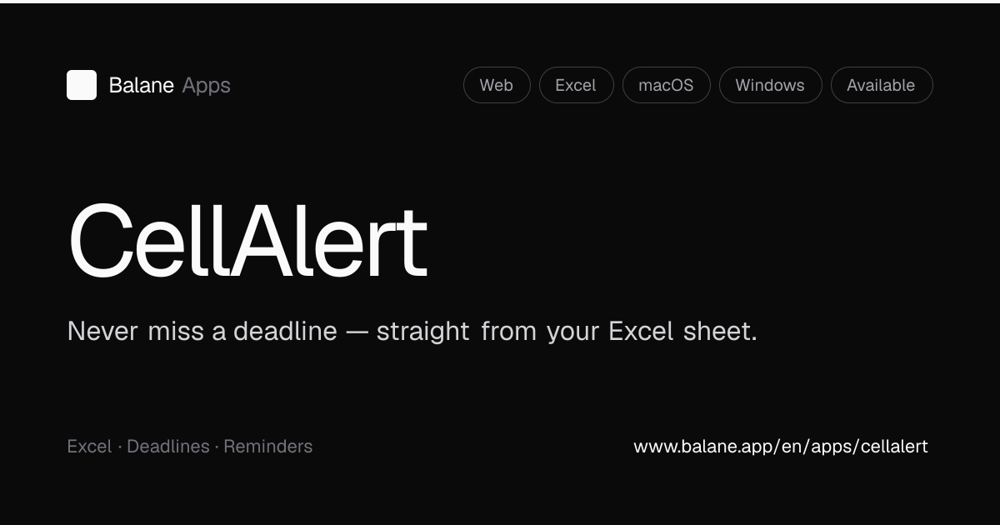
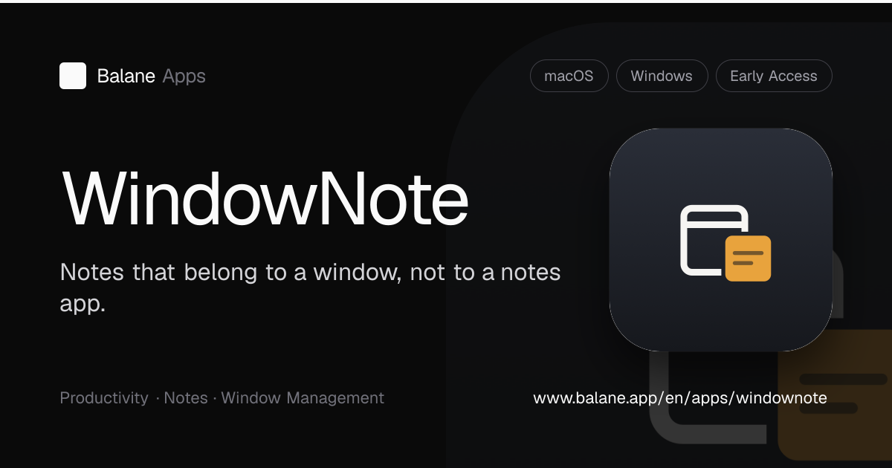
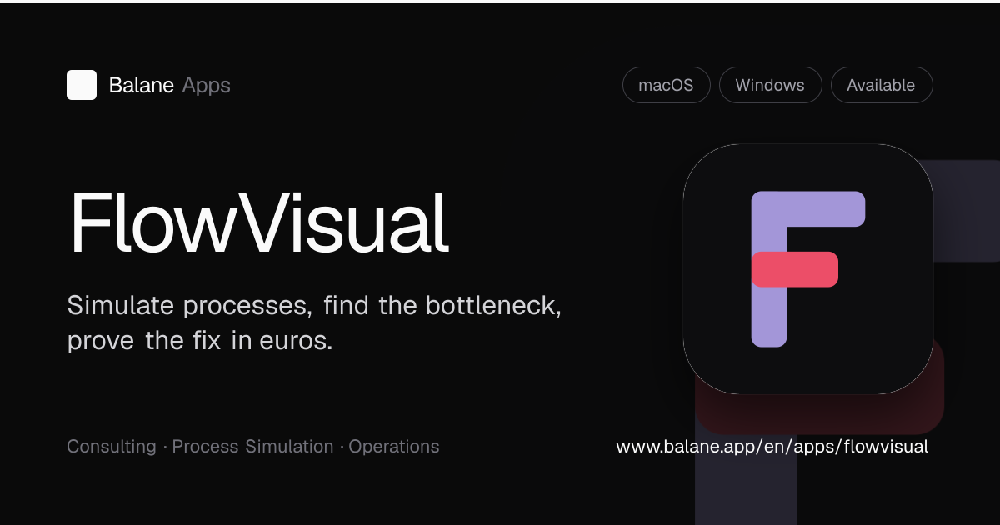
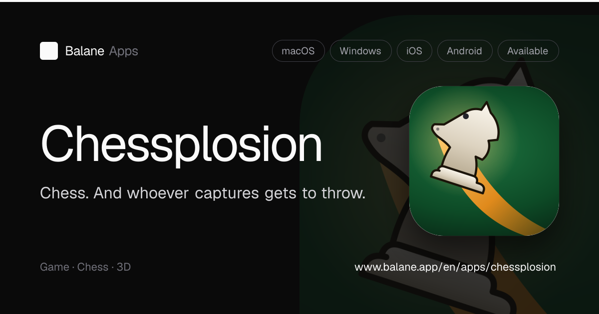
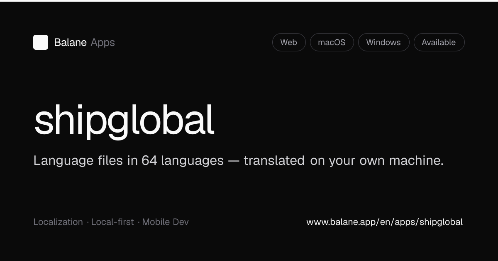

<div align="center">

<picture>
  <source media="(prefers-color-scheme: dark)" srcset=".github/assets/balane-wordmark-white.svg">
  
</picture>

<h1>Releases</h1>

**Official downloads for Balane desktop apps.**<br>
No source code here. Every release carries the signed installers as files.<br>
Built in Munich by [Balane](https://www.balane.app).

[](https://github.com/JHBalane/Balane-Releases/releases)
[](https://www.balane.app/en/status)
[](https://www.balane.app/en/support)
[](https://github.com/JHBalane/Balane-Releases/wiki/Updates-and-Releases)

</div>

## Jump to what you need

| You want to | Go here |
| --- | --- |
| Download an app | [The apps](#the-apps) |
| Find an older version | [All releases](https://github.com/JHBalane/Balane-Releases/releases) |
| Know if a bug is already known | [Status page](https://www.balane.app/en/status) |
| Report a bug | [Open an issue](https://github.com/JHBalane/Balane-Releases/issues/new/choose) |
| Ask a human | [Support](https://www.balane.app/en/support) |
| Understand how updates reach you | [Updates & Releases](https://github.com/JHBalane/Balane-Releases/wiki/Updates-and-Releases) |
| Check a download is intact | [Verify your download](#verify-your-download) |
| Publish a release yourself | [MAINTAINING.md](MAINTAINING.md) |

## The apps

Every download link below always hands you the newest version. No version numbers
to keep track of, no stale links.

<table>
<tr>
<td width="50%" valign="top">

<a href="https://www.balane.app/en/apps/balanedisk"></a>

### BalaneDisk

Finally see what your machine is doing. Every running process as a mark on a
radar, sorted by origin and by how much it costs you.

[macOS](https://www.balane.app/download/balanedisk) · [Windows](https://www.balane.app/download/balanedisk-win) · [All versions](https://github.com/JHBalane/Balane-Releases/releases?q=balanedisk)

</td>
<td width="50%" valign="top">

<a href="https://www.cellalert.app"></a>

### CellAlert

Never miss a deadline, straight from your Excel sheet. Dates in cells become
monitored deadlines with reminders. Excel stays the source of truth.

[macOS](https://www.balane.app/download/cellalert) · [Windows](https://www.balane.app/download/cellalert-win) · [All versions](https://github.com/JHBalane/Balane-Releases/releases?q=cellalert)

</td>
</tr>
<tr>
<td width="50%" valign="top">

<a href="https://www.balane.app/en/apps/windownote"></a>

### WindowNote

Notes that belong to a window, not to a notes app. Hit `⌃⌥⌘N` over any window
and pin a note to it: "migration running, don't close".

[macOS](https://www.balane.app/download/windownote) · [Windows](https://www.balane.app/download/windownote-win) · [All versions](https://github.com/JHBalane/Balane-Releases/releases?q=windownote)

</td>
<td width="50%" valign="top">

<a href="https://www.balane.app/en/apps/flowvisual"></a>

### FlowVisual

Simulate a process, find the bottleneck, prove the fix in euros. Model it from
elements, watch it run live, let a Monte-Carlo stress test expose the weak spot.

[macOS](https://www.balane.app/download/flowvisual) · [Windows](https://www.balane.app/download/flowvisual-win) · [All versions](https://github.com/JHBalane/Balane-Releases/releases?q=flowvisual)

</td>
</tr>
<tr>
<td width="50%" valign="top">

<a href="https://www.balane.app/en/apps/chessplosion"></a>

### Chessplosion

Chess, and whoever captures gets to throw. 3D chess with a second mode you will
not find anywhere else: capture a piece, then throw it back onto the board.

[macOS](https://www.balane.app/download/chessplosion) · Windows: not yet · [All versions](https://github.com/JHBalane/Balane-Releases/releases?q=chessplosion)

</td>
<td width="50%" valign="top">

<a href="https://www.shipglobal.dev/en"></a>

### ship global

Language files in 64 languages, translated on your own machine. Drop in
`.strings`, `.xcstrings`, `strings.xml`, JSON or XLIFF, get it back intact.

[macOS](https://www.shipglobal.dev/en/download) · [Windows](https://www.shipglobal.dev/en/download) · [All versions](https://github.com/JHBalane/Balane-Releases/releases?q=shipglobal)

</td>
</tr>
</table>

## Updates

You download once. After that the app updates itself: on macOS through Sparkle,
in `ship global` through Tauri's own updater. Both check this repository
directly, so a new release is available to you the moment it is published.

The full mechanics, including how to turn updates off, are in
[Updates & Releases](https://github.com/JHBalane/Balane-Releases/wiki/Updates-and-Releases).

## Something broken?

Every reported bug is tracked in the open, from *reported* through *in progress*
to *fixed*:

- [Issues in this repository](https://github.com/JHBalane/Balane-Releases/issues) is the raw list.
- [The status page](https://www.balane.app/en/status) is the same data, sorted by app.

Before you write, check whether it is already there. If it is not,
[Getting Help](https://github.com/JHBalane/Balane-Releases/wiki/Getting-Help)
explains what to include so the bug can actually be fixed.

## Verify your download

Every release lists the SHA-256 sum of each file in its release notes. Compare
after downloading:

```bash
shasum -a 256 FlowVisual-1.2.0.dmg                     # macOS
certutil -hashfile FlowVisual-Setup-1.2.0.exe SHA256   # Windows
```

If the sum does not match the release notes, do not run the file. Tell us at
[Support](https://www.balane.app/en/support).

## For maintainers

Tag naming, per-app quirks, how balane.app resolves the stable download links,
and the bug-tracking labels: [MAINTAINING.md](MAINTAINING.md).
